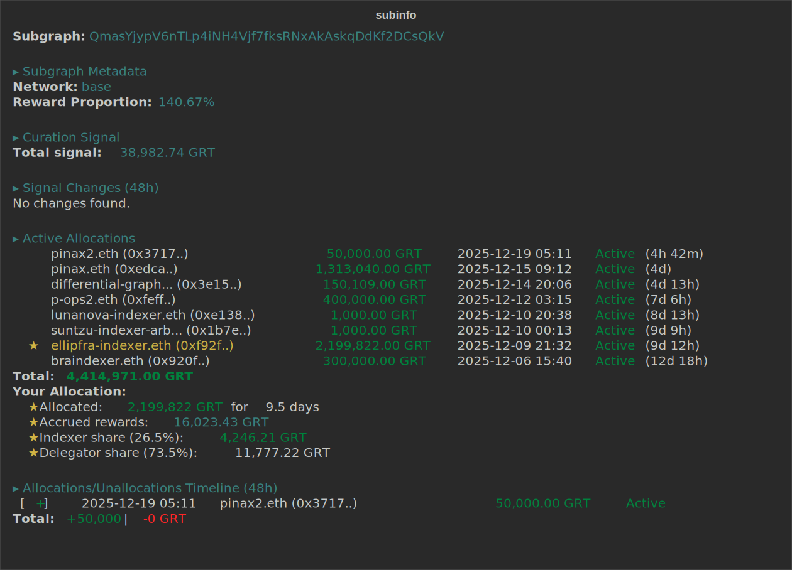
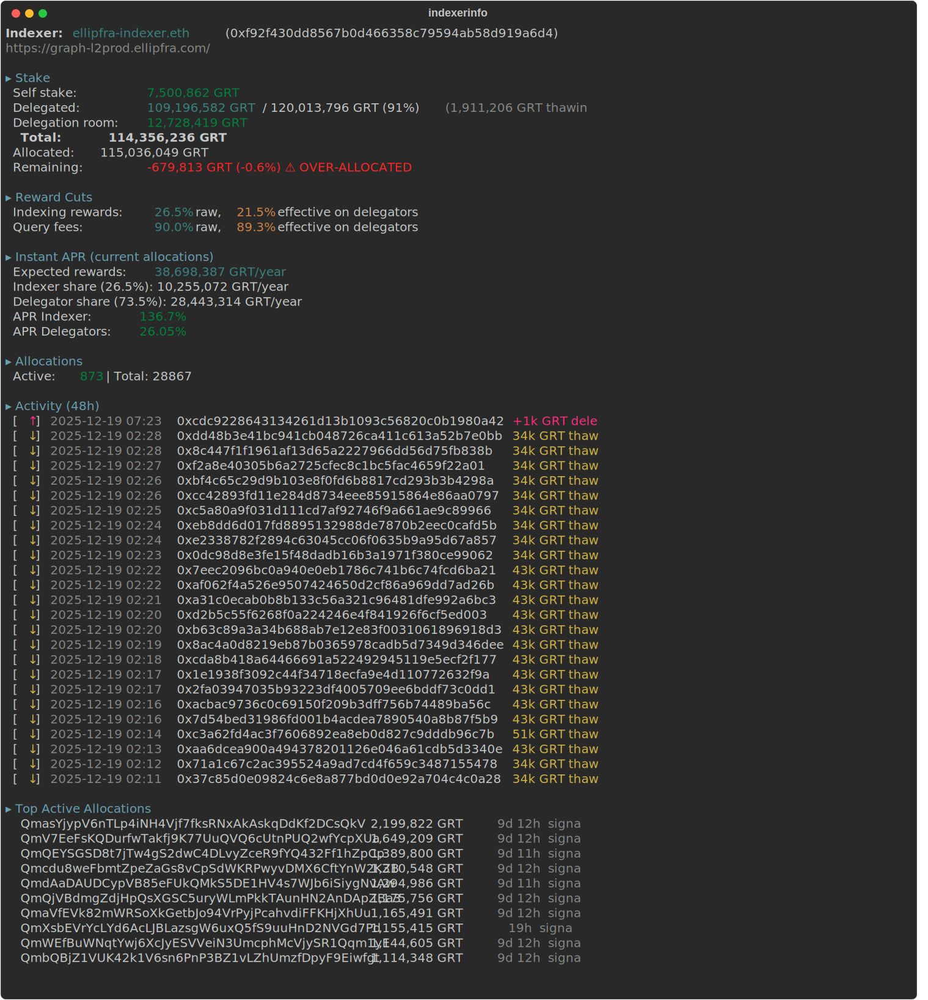

# subinfo

CLI tools to analyze TheGraph Network indexers, allocations and curation signals.

## Tools

### `subinfo` - Subgraph Analysis

Analyze allocations and curation signals for a specific subgraph deployment.

**Features:**
- **Subgraph Metadata**: Network, reward proportion vs network average
- **Curation Signal**: Current signal amount
- **Signal Changes**: Recent signal additions/removals, upgrade detection
- **Active Allocations**: Current indexer allocations with duration
- **Accrued Rewards**: Precise rewards calculation from smart contract for your allocations
- **Allocation Timeline**: Chronological view of allocations/unallocations/collections
- **ENS Resolution**: Automatically resolves indexer addresses to ENS names
- **Clickable Links**: Qm hashes link to The Graph Explorer (in compatible terminals)

### `indexerinfo` - Indexer Analysis

Display detailed information about any indexer.

**Features:**
- **Stake Information**: Self stake, delegated stake, allocation status, delegation room
- **Thawing Delegations**: Shows delegations in withdrawal period
- **Over-allocation Warning**: Detects when allocated > available stake
- **Reward Cuts**: Raw and effective cuts for indexing rewards and query fees
- **Instant APR**: Real-time APR calculation based on current allocations
- **Activity Timeline**: Recent allocations, unallocations, reward collections, delegations/undelegations
- **Top Allocations**: Largest active allocations with signal info
- **Flexible Search**: Find indexers by partial ENS name, address, or URL
- **Clickable Links**: Qm hashes link to The Graph Explorer

## Installation

```bash
# Clone the repository
git clone https://github.com/ellipfra/subinfo.git
cd subinfo

# Run the installation script
./install.sh

# Or install manually
pip3 install -r requirements.txt
pip3 install -e .
```

## Configuration

Configure your TheGraph Network subgraph URL before using the tools.

### Option 1: Environment Variables

```bash
export THEGRAPH_NETWORK_SUBGRAPH_URL="https://your-graph-node/subgraphs/id/QmNetworkSubgraphHash"
export MY_INDEXER_ID="0xYourIndexerAddress"  # Optional: for highlighting your allocations
export ENS_SUBGRAPH_URL="https://your-graph-node/subgraphs/id/QmENSSubgraphHash"  # Optional
```

### Option 2: Configuration File

Edit `~/.subinfo/config.json`:

```json
{
  "network_subgraph_url": "https://your-graph-node/subgraphs/id/QmNetworkSubgraphHash",
  "my_indexer_id": "0xYourIndexerAddress",
  "ens_subgraph_url": "https://your-graph-node/subgraphs/id/QmENSSubgraphHash"
}
```

## Usage

### subinfo

```bash
subinfo <subgraph_hash>
```

**Options:**
- `--url URL`: Override the network subgraph URL
- `--hours N`: Number of hours for history (default: 48)

**Example:**

```bash
subinfo QmYourSubgraphHash
```

**Output:**



### indexerinfo

```bash
indexerinfo <search_term>
```

**Search by:**
- Partial ENS name: `ellipfra`, `pinax`
- Partial address: `0xf92f`, `f92f430`
- Partial URL: `staked.cloud`

**Options:**
- `--hours N`: Number of hours for activity history (default: 48)

**Example:**

```bash
indexerinfo ellipfra
```

**Output:**



## Legend

| Symbol | Meaning |
|--------|---------|
| `★` | Your indexer (configured via `MY_INDEXER_ID`) |
| `[+]` | Allocation created |
| `[-]` | Allocation closed (unallocation) |
| `[$]` | Reward collection (POI submitted) |
| `[↑]` | Subgraph upgrade / Delegation received |
| `[↓]` | Undelegation (shows amount thawing + remaining) |
| `⚠ XX% unallocated` | Warning: indexer has high unallocated stake |
| `⚠ OVER-ALLOCATED` | Warning: allocated more than available stake |
| `(X GRT thawing)` | Delegations in withdrawal period |

## Terminal Compatibility

Qm hashes are rendered as clickable hyperlinks using OSC 8 escape sequences. This works in:
- iTerm2
- kitty
- GNOME Terminal
- Windows Terminal
- Hyper
- Most modern terminal emulators

## License

MIT License - see [LICENSE](LICENSE) file.
